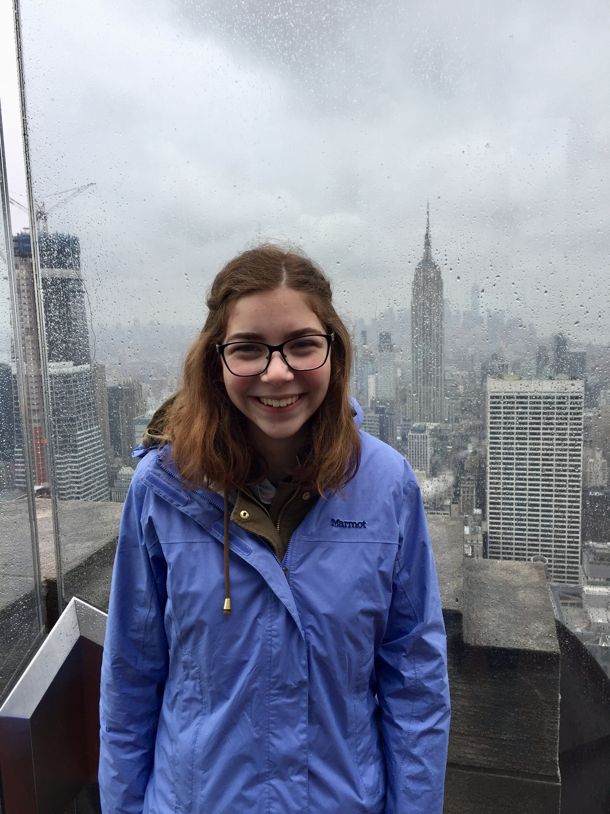

# Team All Stars

{width=250px}

**Team's Main Goal for the Semester:**

To work together effectively to analyze data and come to relevant conclusions.

# About Me Sections

# Johnny Tamanaha

.jpg){width=250px}

**One (non-statistics) Question I Would Like to Know the Answer to That Could be Answered by Analyzing Data:**

How does student knowledge retention from TBL compare to traditional lecture courses?

**What I Would Love to be Doing 6 Months After Graduation:**

Be at a job where I can solidify the data science skills that I learned during school.

**What I Would Love to be Doing 5 Years After Graduation:**

Chilling with other data science homies and making money.

**What I Hope my Greatest Career Accomplishment Will be:**

Finding a new way for data to help in the practice of medicine. 

**What I am Hoping to Learn/Accomplish/Do in This Course:**

Improve my problem solving skills. This means being able to ask better questions and having R in my toolbox to explore solutions. 

**Random Fact**

I'm an extremely picky eater. 

Jingzhi's Feedback: Everything looks great, I learned a lot from your construction.

Kaiyuan Fan's feedback:
I think you do well in your individual part. You have a very clear target for your future.
If you can state some examples of aspect solving skill you want to improve, it'll be better.

Eugene's Feedback: Your section is well formatted and your answers are down to earth and relatable, great work.

Emily's Feedback: I appreciate how you connected your non-statistical question to what we're doing in this course with the TBL, it makes it interesting to think about since we're actually part of it.

# Emily Archambault

{width=150px}

* A question I'd like to learn the answer to by analyzing data would be how US elections would change if we switched to a popular or ranked voting system, instead of using the electoral college
* Six months after graduation, I want to be starting a job or working on a Master's degree in a city I've never lived in before. Five years later, I'd love to be doing economics work in the government or in the Federal Reserve system
* Personally, my biggest career accomplishment would be to be happy in my job and feel like I can see the impacts of what I'm doing in the world around me in some way
* In this course, I'm hoping to get positive exposure to the worlds of data analysis, coding, and statistics, and to see if it's something I'd want to learn more about in the future
* A fun fact about myself is that I once pet Obama's dog while he was President

Jingzhi's Feedback: It is very nice to separate each answer, howere I found that the spacing between each row is a little bit close. Otherwise, everything looks perfect.

Kaiyuan Fan's feedback: 
I think you do well in your individual part. I think you are minded. You have your own thoughts on American politics. 
It's really good that you have your plan after graduation. Morever, if you can give some fields that you may involve in the future, it'll be better.

Eugene's Feedback: I like that you have an idea of what you want to do with your career, and that you are interested in applying data science to other fields, awesome job. 

Johnny's Feedback: I like how you have a goal and plan to use this class to see if data analysis is something you want to learn more about to help you reach that goal. You could 
think about being a little more specific in terms of the "impact" that you said you see from your accomplishments. 

__Eugene Miller__

{width=250px}

**One (non-statistics) Question I Would Like to Know the Answer to That Could be Answered by Analyzing Data:**

How much earlier every year do department stores start selling Christmas decorations?

**What I Would Love to be Doing 6 Months After Graduation:**

Either in a graduate program for data science or doing data science consulting work. 

**What I Would Love to be Doing 5 Years After Graduation:**

Starting my own data consulting firm.

**What I Hope my Greatest Career Accomplishment Will be:**

Using data science to make life on Earth better.

**What I am Hoping to Learn/Accomplish/Do in This Course:**

Learn R and learning the basics of data science.

**Random Fact**

My favorite color is blue.

Jingzhi's Feedback: I think you have a very good format of the questions and answers. There is only one thing, it would be better if you could arrange your photo under your name and also use the first level header to your name. 

Kaiyuan Fan's feedback: 
You do well in this part. I can see your future plan and your dream clearly. It could be better that you can describe a little bit about your firm. 

Emily's Feedback: I think it's cool that you have really specific goals for the future that relate to what we're doing in class. One suggestion would be to add a colon after the "random fact" title so it matches all of the other ones.

Johnny's Feedback: I think it's really cool that you want to start your own consulting firm. My only suggestion would be to make your greatest accomplishment more specific. Do you mean helping the 
environment or helping improve the quality of life for people in poverty etc. 

# Kaiyuan Fan
 {width=250}
 
 
 1.Why people in Boulder love to skating? 

 2.I would love to internship in a big company to gain experience and then five years later I want to be an leader of a team in the company.

 3.The greatest career accomplishment I hope is being an vice president of a middle or big company.
 
 4.I am hoping to learn how to use R language to analyze data and some basic knowledge of statsics. What's more, I want to get  'A-' or 'A' in this course.
 
 5.I like to play pingpang in my spare time. Therefore, if somebody has interest, please contact me.
 

 Jingzhi's Feedback: I think you could add the questions before your answer so that would be easier for reader to read. In general, you are doing a very good job.

 Eugene's Feedback: I too wonder why people in Boulder love to skate. Like Jingzhi said you could have added the questions next to your answers but overall your section is great. 
  
 Emily's Feedback: Your question and random fact are interesting and fun, and I like that you have big aspirations for being in the business world. I'd suggest putting spaces after the numbers for each answer so it looks a little more clean. 

Johnny's Feedback: I like how you have incremental goals all the way up to what you want your greatest accomplishment to be. I would just suggest adding the questions before each number so that there
is a little more context before each question. 

# Jingzhi Zhang

 {width=300}

**One (non-statistics) Question I Would Like to Know the Answer to That Could be Answered by Analyzing Data:**

* Why do people lives in Boulder like to ask international student "How do you like Boulder?"

**What I Would Love to be Doing 6 Months After Graduation:**

* Find an internship after six months.

**What I Would Love to be Doing 5 Years After Graduation:**

* Have a happy family after five years

**What I Hope my Greatest Career Accomplishment Will be:**

* To be a successful bussiness woman like my mother

**What I am Hoping to Learn/Accomplish/Do in This Course:**

* To learn how to use R studio and use R studio to help me analyze data

**Random Fact**

* The assignment due on my birthday, such a sad thing.

Kaiyuan Fan's feedback: I think your individual part is good. You are quite creative. By the way, I want to say "Happy birthday to you". 

Eugene's Feedback: Your section is very well formatted and neat, great job. Also, happy birthday!

Emily's Feedback: Happy birthday! I like the formatting of your section with the bold questions and bulleted answers. You could give expand on some of your responses so we know more information, but nice job!

Johnny's Feedback: I like how your answers are consice and to the point. I would suggest adding a little more detail for some questions, but besides that everything looks good. Also, we should sing happy birthday 
in class.