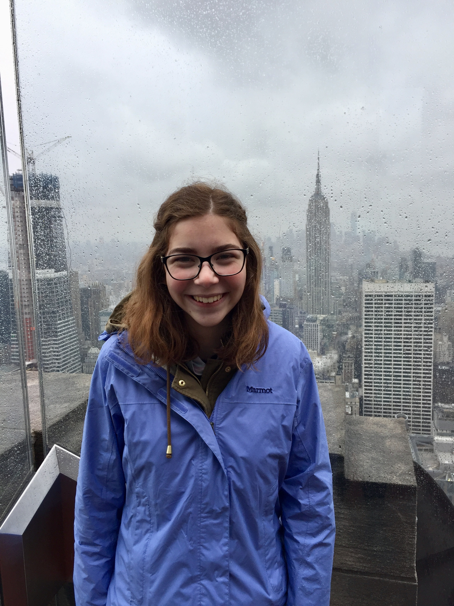
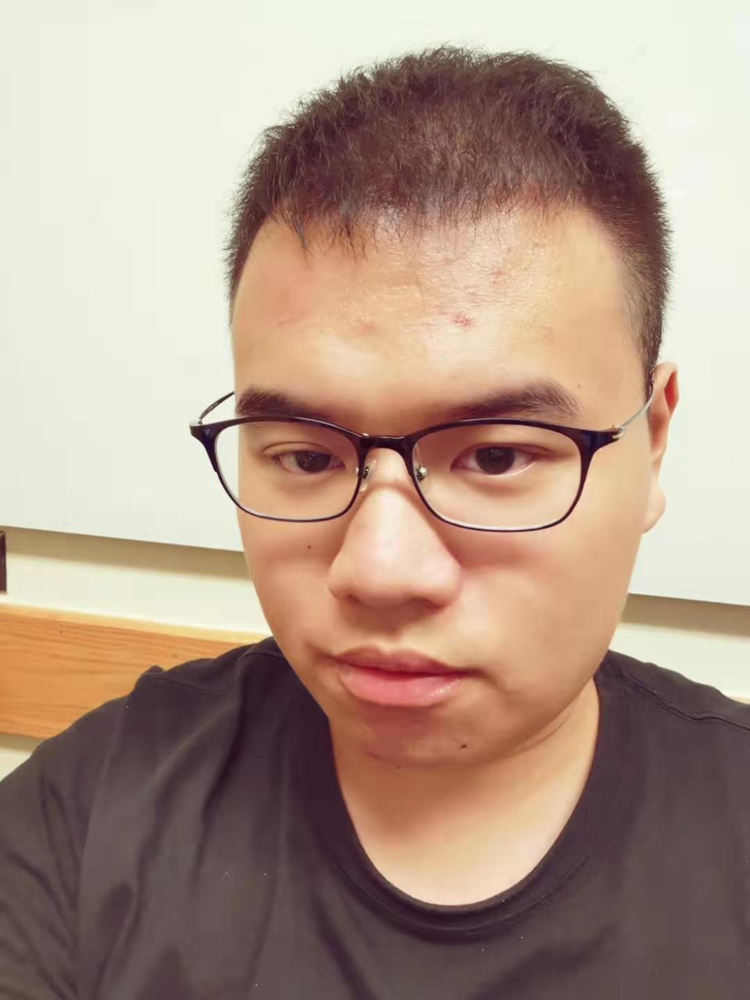

---
title: "Lab2 Individual"
author: "All Stars"
date: "9/4/2019"
output: html_document
---

Team Photo

# Team All Stars

Team's Main Goal for the Semester

# Johnny Tamanaha

.jpg){width=250px}

**One (non-statistics) Question I Would Like to Know the Answer to That Could be Answered by Analyzing Data:**

How does student knowledge retention from TBL compare to traditional lecture courses?

**What I Would Love to be Doing 6 Months After Graduation:**

Be at a job where I can solidify the data science skills that I learned during school.

**What I Would Love to be Doing 5 Years After Graduation:**

Chilling with other data science homies and making money.

**What I Hope my Greatest Career Accomplishment Will be:**

Finding a new way for data to help in the practice of medicine. 

**What I am Hoping to Learn/Accomplish/Do in This Course:**

Improve my problem solving skills. This means being able to ask better questions and having R in my toolbox to explore solutions. 

**Random Fact**

I'm an extremely picky eater. 

**Feedback** I think you did very well 

# Emily Archambault

{width=150px}

* A question I'd like to learn the answer to by analyzing data would be how US elections would change if we switched to a popular or ranked voting system, instead of using the electoral college
* Six months after graduation, I want to be starting a job or working on a Master's degree in a city I've never lived in before. Five years later, I'd love to be doing economics work in the government or in the Federal Reserve system
* Persoanlly, my biggest career accomplishment would be to be happy in my job and feel like I can see the impacts of what I'm doing in the world around me in some way
* In this course, I'm hoping to get positive exposure to the worlds of data analysis, coding, and statistics, and to see if it's something I'd want to learn more about in the future
* A fun fact about myself is that I once pet Obama's dog while he was President

Jingzhi's Feedback:  

__Eugene Miller__
{width=250px}

**One (non-statistics) Question I Would Like to Know the Answer to That Could be Answered by Analyzing Data:**

How much earlier every year do department stores start selling Christmas decorations?

**What I Would Love to be Doing 6 Months After Graduation:**

Either in a graduate program for data science or doing data science consulting work. 

**What I Would Love to be Doing 5 Years After Graduation:**

Starting my own data consulting firm.

**What I Hope my Greatest Career Accomplishment Will be:**

Using data science to make life on Earth better.

**What I am Hoping to Learn/Accomplish/Do in This Course:**

Learn R and learning the basics of data science.

**Random Fact**

My favorite color is blue.

Jingzhi's Feedback: I think you have a very good format of the questions and answers. There is only one thing, it would be better if you could arrange your photo under your name and also use the first level header to your name. 

# Kaiyuan Fan
 {width=250}
 
 
 1.Why people in Boulder love to skating? 
 2.I would love to internship in a big company to gain experience and then five years later I want to be an leader of a team in the company.
 3.The greatest career accomplishment I hope is being an vice president of a middle or big company.
 4.I am hoping to learn how to use R language to analyze data and some basic knowledge of statsics. What's more, I want to get  'A-' or 'A' in this course.
 5.I like to play pingpang in my spare time. Therefore, if somebody has interest, please contact me.
 

Jingzhi's Feedback: Could you please 

# Jingzhi Zhang

 {width=300}

**One (non-statistics) Question I Would Like to Know the Answer to That Could be Answered by Analyzing Data:**

* How many people in the world

**What I Would Love to be Doing 6 Months After Graduation:**

* Find an internship after six months.

**What I Would Love to be Doing 5 Years After Graduation:**

* Have a happy family after five years

**What I Hope my Greatest Career Accomplishment Will be:**

* To be a successful bussiness woman like my mother

**What I am Hoping to Learn/Accomplish/Do in This Course:**

* To learn how to use R studio and use R studio to help me analyze data

**Random Fact**

* The assignment due on my birthday, such a sad thing.

